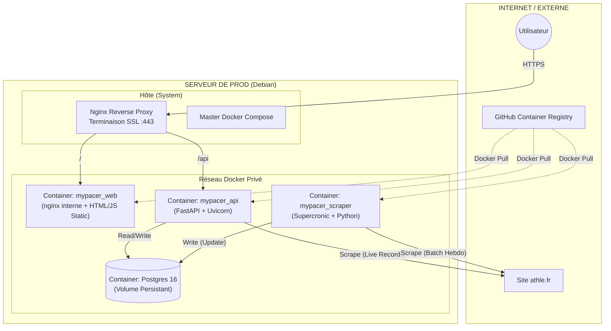

# 🏃 MyPacer Infrastructure

Ce dépôt contient la configuration de déploiement (Infrastructure as Code) et la documentation opérationnelle de la plateforme **MyPacer**.

## 📚 Documentation

- **[PRD.md](./PRD.md)** : Product Requirements Document - Vision produit, fonctionnalités, roadmap
- **[STAGING.md](./STAGING.md)** : Guide de l'environnement de staging
- **[PRODUCTION.md](./PRODUCTION.md)** : Guide de l'environnement de production
- **[PLAN.md](../PLAN.md)** : Plan de développement et historique du projet

---

## 🏗 Architecture Globale

L'application suit une architecture **Micro-services** conteneurisée, orchestrée par Docker Compose sur un serveur unique.


## 🧩 Rôles des Services

- **Web (Frontend)** : Interface utilisateur pour la visualisation et la comparaison.
- **API (Backend)** : Calculateur mathématique + Passerelle "Live" vers `athle.fr` pour les chronos.
- **Scraper (Worker)** : Tâche de fond construisant l'index de recherche (annuaire) pour garantir la rapidité de la fonctionnalité "Smart Search".

## 🚀 Déploiement Docker Compose (prod)

### Pré-requis
- Docker + Docker Compose v2 sur le serveur cible
- Accès au GHCR (se connecter : `echo $GHCR_TOKEN | docker login ghcr.io -u <gh-user> --password-stdin`)
- Nginx installé sur l'hôte (reverse-proxy et TLS)

### 1) Configurer les variables
Copier le fichier d'exemple et adapter les secrets :
```bash
cp .env.example .env
```
- `POSTGRES_*` : identifiants/DB (utilisés par scraper + API)
- `API_PORT` / `WEB_PORT` : ports exposés sur l'hôte (vus par Nginx)
- `*_IMAGE_TAG` : `latest-prod` par défaut ou un tag versionné (`v1.2.3-prod`)

### 2) Récupérer et lancer les conteneurs
```bash
docker compose --env-file .env -f docker-compose.prod.yml pull
docker compose --env-file .env -f docker-compose.prod.yml up -d
```
- Scraper : `ghcr.io/cmoron/mypacer_scraper:${SCRAPER_IMAGE_TAG}`
- API : `ghcr.io/cmoron/mypacer_api:${API_IMAGE_TAG}`
- Front : `ghcr.io/cmoron/mypacer_web:${WEB_IMAGE_TAG}`

### 3) Configuration Nginx (reverse proxy sur l'hôte)

Les configurations Nginx sont dans le repo **mypacer_web** :
- `mypacer_web/nginx/mypacer.fr.conf` → Configuration production
- `mypacer_web/nginx/stage.mypacer.fr.conf` → Configuration staging

**Déploiement en production** :
```bash
# Depuis votre poste local
cd /path/to/mypacer_web
git pull origin main

# Copier la config sur le serveur
scp nginx/mypacer.fr.conf user@prod-server:/tmp/

# Sur le serveur de production
ssh user@prod-server
sudo cp /tmp/mypacer.fr.conf /etc/nginx/sites-available/mypacer.fr
sudo ln -sf /etc/nginx/sites-available/mypacer.fr /etc/nginx/sites-enabled/
sudo nginx -t && sudo systemctl reload nginx
```

**Note** : La config utilise `/api/` pour router vers l'API (pas de sous-domaine séparé).
Les certificats SSL sont gérés par Certbot et déjà configurés dans les fichiers Nginx.

## 🛠 Notes CI/CD
- Les images `mypacer_scraper`, `mypacer_api` et `mypacer_web` sont publiées sur GHCR via leurs workflows GitHub Actions (`latest-prod`, tags semver et SHA).
- Le fichier `docker-compose.prod.yml` consomme ces images directement ; il suffit de changer `*_IMAGE_TAG` pour faire un rollback ou geler une version.

---

## 🚀 Guides opérationnels

### Pour développer et tester
- **Développement local** : Voir les README des repos individuels (mypacer_web, mypacer_api, mypacer_scraper)
- **[Environnement staging](./STAGING.md)** : Déploiement automatique, tests pré-production

### Pour déployer en production
- **[Environnement production](./PRODUCTION.md)** : Workflow de release, monitoring, backups, troubleshooting

### Pour comprendre la vision produit
- **[PRD - Product Requirements Document](./PRD.md)** : Vision, personas, fonctionnalités actuelles et futures

---

## 📊 État actuel

- **Production** : https://mypacer.fr (v0.2.0)
  - 940,868 athlètes
  - 3,419 clubs
  - Architecture Docker complète
  - Uptime 99.9%

- **Staging** : https://stage.mypacer.fr
  - Déploiement automatique sur push `main`
  - Base de données isolée
  - Tests pré-production

---

## 🏗️ Repositories

- **[mypacer_web](https://github.com/cmoron/mypacer_web)** : Frontend Svelte + Vite
- **[mypacer_api](https://github.com/cmoron/mypacer_api)** : Backend FastAPI
- **[mypacer_scraper](https://github.com/cmoron/mypacer_scraper)** : Scraper FFA (cron hebdomadaire)
- **[mypacer_infra](https://github.com/cmoron/mypacer_infra)** : Infrastructure Docker Compose (ce repo)
