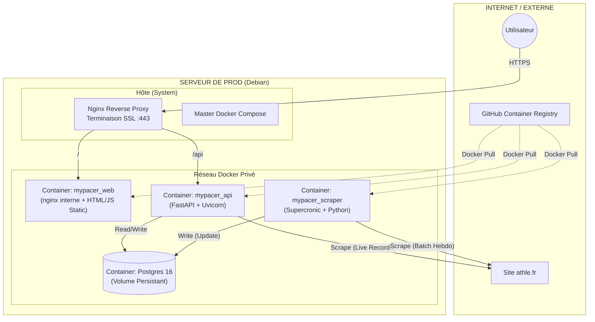

# 🏃 MyPacer Infrastructure

Ce dépôt contient la configuration de déploiement (Infrastructure as Code) et la documentation architecturale de la plateforme **MyPacer**.

## 🏗 Architecture Globale

L'application suit une architecture **Micro-services** conteneurisée, orchestrée par Docker Compose sur un serveur unique.


## 🚀 Déploiement Docker Compose (prod)

### Pré-requis
- Docker + Docker Compose v2 sur le serveur cible
- Accès au GHCR (se connecter : `echo $GHCR_TOKEN | docker login ghcr.io -u <gh-user> --password-stdin`)
- Nginx installé sur l'hôte (reverse-proxy et TLS)

### 1) Configurer les variables
Copier le fichier d'exemple et adapter les secrets :
```bash
cp .env.example .env
```
- `POSTGRES_*` : identifiants/DB (utilisés par scraper + API)
- `API_PORT` / `WEB_PORT` : ports exposés sur l'hôte (vus par Nginx)
- `*_IMAGE_TAG` : `latest-prod` par défaut ou un tag versionné (`v1.2.3-prod`)

### 2) Récupérer et lancer les conteneurs
```bash
docker compose --env-file .env -f docker-compose.prod.yml pull
docker compose --env-file .env -f docker-compose.prod.yml up -d
```
- Scraper : `ghcr.io/cmoron/mypacer_scraper:${SCRAPER_IMAGE_TAG}`
- API : `ghcr.io/cmoron/mypacer_api:${API_IMAGE_TAG}`
- Front : `ghcr.io/cmoron/mypacer_web:${WEB_IMAGE_TAG}`

### 3) Reverse-proxy Nginx (hôte)
Deux configs prêtes à copier sur le serveur :
- `nginx_host/mypacer.fr`    → proxy vers le front (port `WEB_PORT`, défaut 8080)
- `nginx_host/api.mypacer.fr` → proxy vers l'API (port `API_PORT`, défaut 8000)

Exemple (sur l'hôte) :
```bash
sudo cp nginx_host/mypacer.fr /etc/nginx/sites-available/
sudo cp nginx_host/api.mypacer.fr /etc/nginx/sites-available/
sudo ln -s /etc/nginx/sites-available/mypacer.fr /etc/nginx/sites-enabled/
sudo ln -s /etc/nginx/sites-available/api.mypacer.fr /etc/nginx/sites-enabled/
sudo nginx -t && sudo systemctl reload nginx
```
Ajouter/adapter la terminaison TLS (certbot) dans ces fichiers si besoin.

## 🛠 Notes CI/CD
- Les images `mypacer_scraper`, `mypacer_api` et `mypacer_web` sont publiées sur GHCR via leurs workflows GitHub Actions (`latest-prod`, tags semver et SHA).
- Le fichier `docker-compose.prod.yml` consomme ces images directement ; il suffit de changer `*_IMAGE_TAG` pour faire un rollback ou geler une version.
